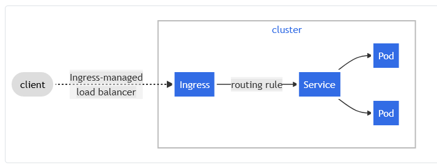

Meu primeiro deployment em produção foram algumas instâncias de wordpress CMS rodando em AKS.
Esse modelo utiliza Ingress NGINX, Métricas, e dois drivers de storage class Azure Files e Longhorn.

[Repositório GitHub](https://github.com/pedrolsazevedo/containers/tree/main/docs/kubernetes/modelos/wordpress)

## **Descrição dos objetos**  
[**00-wp-namespace.yaml**](deployment/00-wp-namespace.yaml)  
Esse arquivo cria o grupo onde os recursos serão criados e executados.  

***

[**01-wp-pvc.yaml**](deployment/01-wp-pvc.yaml)  
Este arquivo cria dois PVC, um com a storageclass Longhorn e outro com AzureFiles.  
A aplicação fica alocada ao volume criado no longhorn, utilizamos o azurefiles para que o pod no cronjob crie um backup diário dos arquivos da aplicação.  

* **wp-pvc-longhorn-claim**  
  Tamanho: 5Gi  
  StorageClass: longhorn  
  Modo de leitura: ReadWriteMany  
  Descrição: Permite que todos os pods acessem o volume.  

* **wp-pvc-azurefiles-claim**  
  Tamanho: 15Gi  
  StorageClass: azurefile  
  Modo de leitura: ReadWriteOnce  
  Descrição:  Volume é montado uma vez por dia, no pod que faz o backup.  

***
[**02-wp-configmap-secrets.yaml**](deployment/02-wp-configmap-secrets.yaml)  
Este arquivo cria um `ConfigMap` com o .htaccess e um `secret` para armazenar as credenciais de banco.  

* `wp-cm-htaccess`  
  Criei este `ConfigMap` para facilitar quando for necessário aumentar o valor do upload_max_filesize e configurações necessárias para enviar arquivos mais pesados.  

* `wp-cm-dbcred`  
  Para configurar as credenciais de banco, os valores precisão ser convertidos para base64 e ajustados no arquivo, isso fará com que cada container no pod receba o valor como uma variável de ambiente.  

***

[**03-wp-deployment.yaml**](deployment/03-wp-deployment.yaml)  
Este é o principal arquivo, ele irá criar um deployment que criará e configurará os pods nos nods para disponibilizarem a aplicação.  

  * A imagem base utilizada é:  
      ```yaml
      image: wordpress:php8.1-apache
      ```
  * Possuimos limitação de recursos para cada pod:  
      ```yaml
      resources:  
        cpu:
          requests: 100mi (Valor requisitado quando o pod é criado)
          limit: 200mi (Valor máximo que pode ser alocado para cada pod)
        memory:
          requests: 256Mi (Valor requisitado quando o pod é criado)
          limit: 512Mi (Valor máximo que pode ser alocado para cada pod)
      ```

***

[**04-wp-hpa.yaml**](deployment/04-wp-hpa.yaml)
Este arquivo criará a configuração de dimensionamento automático horizontal, que garante uma quantidade minima e máxima de réplicas dos pods rodando de acordo com a necessidade.

Seu cluster acompanha o consumo dos pods e compara, total do consumo com o valor máximo definido pelo `limit` no arquivo anterior, e caso atinga o percentual abaixo ele provisionará um novo pod. Caso o consumo reduza, ele reduzirá a quantidade de pods de maneira automatica tambem.

  * Definição do minimo e máximo de pods que rodarão
    ```yaml
    minReplicas: 1 # (Minimo de pods rodando)
    maxReplicas: 6 # (Máximo de pods rodando)
    ```
  * Percentual de recurso que o kubernetes deverá considerar para escalar os pods
    ```yaml
    resources:
      cpu:
        targetAverageUtilization: 80 # (Percentual de uso médio do processador para fazer o escalonamento)
      memory:
        targetAverageUtilization: 80 # Percentual de uso médio de memória para fazer o escalonamento
    ```
***

[**05-wp-backupfile-cronjob.yaml**](deployment/05-wp-backupfile-cronjob.yaml)  
Este arquivo cria um `CronJob` que será executado todo dia à 01:01.  
Durante a execução o pod irá criar um arquivo compactado do conteudo do wordpress e guardará no armazenamento do AzureFiles.  
Para alterar o horário de execução, basta alterar o seguimento `schedule` no arquivo.
  ```yaml
  schedule: "1 1 * * *"
  ```

[**06-wp-service-ingress.yaml**](deployment/06-wp-service-ingress.yaml)  
Este arquivo cria dois componentes que possibilitam o acesso aos recursos que voce criou:
  * Service
    Cria uma exposição dos pods no namespace, para que voce possa acessar a porta configurada ou com port-forwarding ou com o ingress, por exemplo.

  * Ingress
    O ingress é o responsável por expor as rotas de acesso para fora do cluster.

  

***

## Documentação oficial  
[**Namespace**](https://kubernetes.io/docs/concepts/overview/working-with-objects/namespaces/)  
[**Persistent Volumes**](https://kubernetes.io/docs/concepts/storage/persistent-volumes/)  
[**ConfigMap**](https://kubernetes.io/docs/concepts/configuration/configmap/)  
[**Secret**](https://kubernetes.io/docs/concepts/configuration/secret/)  
[**Deployments**](https://kubernetes.io/docs/concepts/workloads/controllers/deployment/)  
[**Horizontal Pod Autoscaling**](https://kubernetes.io/docs/tasks/run-application/horizontal-pod-autoscale/)  
[**CronJob**](https://kubernetes.io/pt-br/docs/concepts/workloads/controllers/cron-jobs/)  
[**Service**](https://kubernetes.io/docs/concepts/services-networking/service/)  
[**Ingress**](https://kubernetes.io/docs/concepts/services-networking/ingress/)  